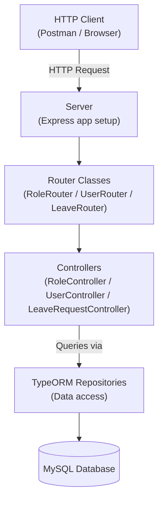
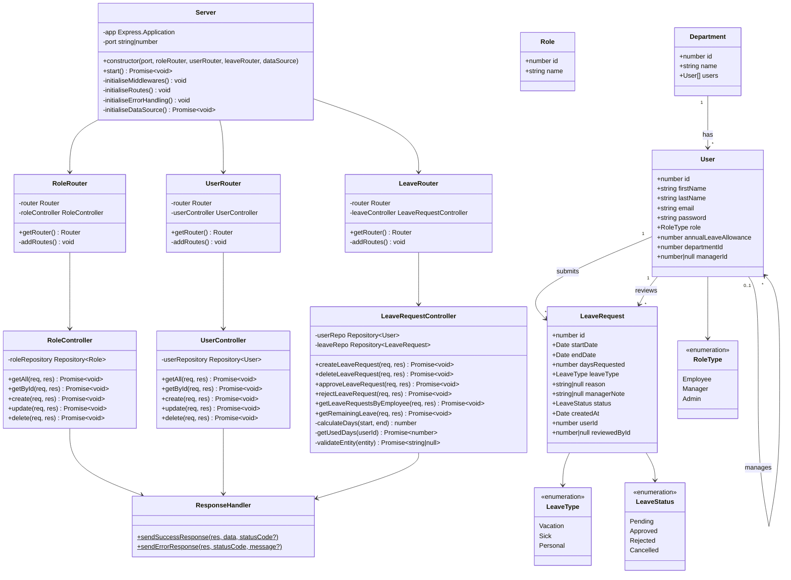
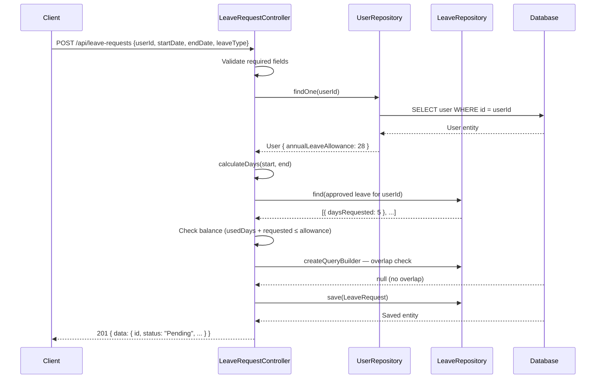
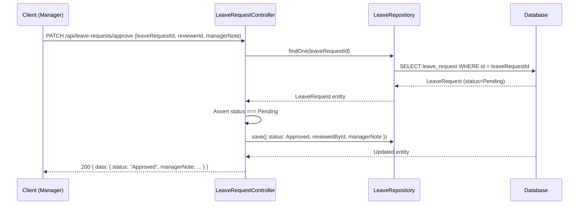
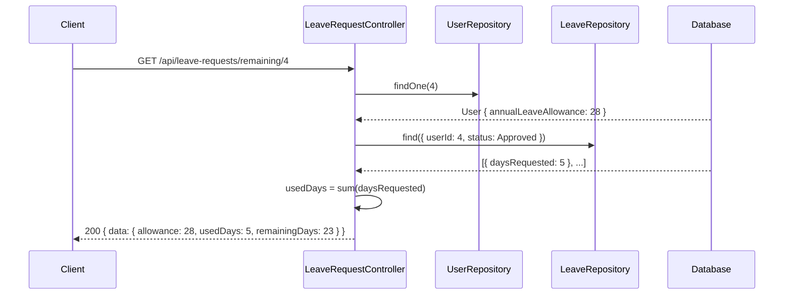

# Leave Management System — Technical Documentation

## Table of Contents

1. [System Overview](#1-system-overview)
2. [Architecture](#2-architecture)
3. [Class Diagram](#3-class-diagram)
4. [Sequence Diagrams](#4-sequence-diagrams)
5. [OOP Principles](#5-oop-principles)
6. [SOLID Principles](#6-solid-principles)
7. [GRASP Principles](#7-grasp-principles)
8. [API Reference](#8-api-reference)

---

## 1. System Overview

A RESTful leave management API built with **TypeScript**, **Express**, and **TypeORM** (MySQL). Employees submit leave requests; managers approve or reject them. The system enforces business rules: balance checks, overlap prevention, and status transitions.

**Key technologies:**

| Concern    | Technology              |
|------------|-------------------------|
| Runtime    | Node.js + TypeScript    |
| HTTP       | Express 5               |
| ORM        | TypeORM 0.3             |
| Database   | MySQL                   |
| Validation | class-validator         |
| Logging    | Winston (via `Logger`)  |
| HTTP logs  | Morgan                  |
| Testing    | Jest + Supertest        |

---

## 2. Architecture

### 2.1 Layer Diagram



### 2.2 Request Flow

Every request follows the same path through four layers:

```
index.ts (composition root)
  └── Server (initialises middleware, routes, error handling)
        └── Router class (maps HTTP method + path → controller method)
              └── Controller (validates input, queries repos, sends response)
                    └── TypeORM Repository (SQL via ORM)
```

### 2.3 Composition Root (`index.ts`)

All objects are created and wired together in `index.ts`:

```typescript
const roleRouter = new RoleRouter(Router(), new RoleController(AppDataSource.getRepository(Role)))
const userRouter = new UserRouter(Router(), new UserController(AppDataSource.getRepository(User)))
const leaveRouter = new LeaveRouter(Router(), new LeaveRequestController(...))

const server = new Server(port, roleRouter, userRouter, leaveRouter, AppDataSource)
server.start()
```

Dependencies flow inward — `Server` knows about routers, routers know about controllers, controllers know about repositories.

---

## 3. Class Diagram



---

## 4. Sequence Diagrams

### 4.1 Submit Leave Request



### 4.2 Approve Leave Request



### 4.3 View Remaining Leave



---

## 5. OOP Principles

### 5.1 Abstraction

**Definition:** Hiding implementation complexity behind a clear, simplified interface. Callers work with the "what", not the "how".

**Where it's applied:**

`ResponseHandler` abstracts HTTP response formatting. Every controller calls the same two static methods regardless of which endpoint it is — the JSON structure and status code logic is hidden inside:

```typescript
// Controller only knows "send a success" — not how it's formatted
ResponseHandler.sendSuccessResponse(res, newRole, StatusCodes.CREATED)

// Controller only knows "send an error" — not the JSON shape
ResponseHandler.sendErrorResponse(res, StatusCodes.NOT_FOUND, `Role not found with ID: ${id}`)
```

`Logger` abstracts the Winston library. Controllers and the Server call `Logger.info(...)` or `Logger.error(...)` without knowing about transports, file paths, or log levels.

The `src/interfaces/` directory defines domain contracts — `Role`, `User`, `LeaveRequest`, `UserManagement` — that describe what an object _is_ without specifying _how_ it is stored. The model classes in `src/models/` implement these interfaces separately from the TypeORM entities.

---

### 5.2 Encapsulation

**Definition:** Bundling data and behaviour together, and restricting direct access to an object's internal state.

**Where it's applied:**

`LeaveRequestController` keeps its helper logic private — callers cannot invoke them directly:

```typescript
export class LeaveRequestController {
    // Internal calculation — not accessible from outside
    private calculateDays(start: Date, end: Date): number { ... }
    private async getUsedDays(userId: number): Promise<number> { ... }
    private async validateEntity(entity: object): Promise<string | null> { ... }

    // Public entry points — these are the only methods the router sees
    public createLeaveRequest = async (req, res) => { ... }
    public approveLeaveRequest = async (req, res) => { ... }
}
```

`Server` encapsulates the entire Express application setup. External code cannot call `initialiseMiddlewares()` or `initialiseRoutes()` directly — only `start()` is public:

```typescript
export class Server {
    private initialiseMiddlewares(): void { ... }
    private initialiseRoutes(): void { ... }
    private initialiseErrorHandling(): void { ... }
    private async initialiseDataSource(): Promise<void> { ... }

    public async start(): Promise<void> { ... } // only public method
}
```

TypeORM entities encapsulate their columns and relationships via decorators — external code works with typed properties, not raw SQL columns.

---

### 5.3 Inheritance

**Definition:** A class (subclass) inherits properties and behaviour from a parent class (superclass), enabling code reuse and specialisation.

**Where it's applied:**

The model classes in `src/models/` implement the interfaces defined in `src/interfaces/`. For example, `User` in `src/models/User.class.ts` implements the `User` interface from `src/interfaces/User.interface.ts` — it inherits the structural contract and provides the concrete implementation.

The Router classes (`RoleRouter`, `UserRouter`, `LeaveRouter`) all share the same structural pattern — `constructor`, `getRouter()`, `addRoutes()`. This common shape means they can all be used interchangeably by `Server`, which only calls `getRouter()` on each:

```typescript
// Server treats all routers the same — same inherited shape
this.app.use('/api/roles',          this.roleRouter.getRouter())
this.app.use('/api/users',          this.userRouter.getRouter())
this.app.use('/api/leave-requests', this.leaveRouter.getRouter())
```

---

### 5.4 Polymorphism

**Definition:** The ability for different types to be treated interchangeably through a common interface, with each type providing its own implementation.

**Where it's applied:**

`Server` holds three router instances of different concrete types (`RoleRouter`, `UserRouter`, `LeaveRouter`). It calls `getRouter()` on each without knowing or caring which specific type it is — all three provide the same method:

```typescript
// Polymorphic — each router type provides getRouter() differently
private initialiseRoutes(): void {
    this.app.use('/api/roles',          this.roleRouter.getRouter())
    this.app.use('/api/users',          this.userRouter.getRouter())
    this.app.use('/api/leave-requests', this.leaveRouter.getRouter())
}
```

In the router tests, `RoleController`, `UserController`, and `LeaveRequestController` are replaced with mock objects at test time. The router doesn't know it's receiving a mock — it just calls methods on whatever object was injected:

```typescript
// During tests — a mock is substituted polymorphically
const mockRoleController = {
    getAll: jest.fn((_req, res) => res.status(200).json([])),
    ...
} as unknown as RoleController

const roleRouter = new RoleRouter(router, mockRoleController) // router can't tell the difference
```

The `LeaveStatus` enum enables polymorphic branching — the same `leaveRequest.status` field drives different outcomes (approve, reject, delete guards all branch on its value).

---

## 6. SOLID Principles

### S — Single Responsibility Principle

> _A class should have only one reason to change._

Every class has a single, clearly bounded responsibility:

| Class                    | Single responsibility                                   |
|--------------------------|---------------------------------------------------------|
| `Server`                 | Bootstrap the Express application                       |
| `RoleRouter`             | Map HTTP routes to `RoleController` methods             |
| `UserRouter`             | Map HTTP routes to `UserController` methods             |
| `LeaveRouter`            | Map HTTP routes to `LeaveRequestController` methods     |
| `RoleController`         | Handle HTTP for role CRUD                               |
| `UserController`         | Handle HTTP for user CRUD                               |
| `LeaveRequestController` | Handle HTTP for leave request operations                |
| `ResponseHandler`        | Format and send HTTP responses                          |
| `Logger`                 | Write structured log output                             |

If the database changes to PostgreSQL, only `data_source.ts` and migration files change. If the response format changes, only `ResponseHandler` changes. If leave business rules change, only `LeaveRequestController` changes.

---

### O — Open/Closed Principle

> _Software entities should be open for extension, but closed for modification._

Adding a new resource (e.g. `Department`) requires creating a new `DepartmentController` and `DepartmentRouter` and registering them in `Server` — no existing classes need to be modified.

New leave types are added to the `LeaveType` enum without touching any controller logic:

```typescript
export enum LeaveType {
    Vacation = 'Vacation',
    Sick     = 'Sick',
    Personal = 'Personal',
    // Add new types here — no controller changes needed
}
```

`Server` is open for extension (new routers can be injected via the constructor) but closed for modification — existing routes are untouched when new ones are added.

---

### L — Liskov Substitution Principle

> _Subtypes must be substitutable for their base types._

The router tests demonstrate LSP directly. A mock controller is substituted in place of the real `RoleController` — the `RoleRouter` behaves identically because the mock satisfies the same interface:

```typescript
// Real controller and mock are interchangeable from RoleRouter's perspective
const mockRoleController = { getAll: jest.fn(...), ... } as unknown as RoleController
const roleRouter = new RoleRouter(router, mockRoleController)
```

The `Role`, `User`, `LeaveRequest`, and `UserManagement` model classes are substitutable for their interface types — any code typed against the interface works with the concrete model class.

---

### I — Interface Segregation Principle

> _Clients should not be forced to depend on interfaces they don't use._

The `src/interfaces/` directory defines four focused, independent contracts:

- `Role` — just `roleId` and `name`
- `User` — user profile fields only
- `LeaveRequest` — leave-specific fields only
- `UserManagement` — manager relationship only

Each interface is small and single-purpose. A class that only needs to know about roles imports `Role` alone — it is not forced to take on `UserManagement` concerns.

The controllers receive focused TypeORM `Repository<T>` types rather than the entire `DataSource`. `LeaveRequestController` receives exactly `Repository<User>` and `Repository<LeaveRequest>` — nothing more.

---

### D — Dependency Inversion Principle

> _High-level modules should depend on abstractions, not concrete implementations._

All dependencies are injected via constructors — nothing creates its own dependencies internally:

```typescript
// RoleController doesn't create its repository — it receives it
export class RoleController {
    constructor(private roleRepository: Repository<Role>) {}
}

// RoleRouter doesn't create its controller — it receives it
export class RoleRouter {
    constructor(private router: Router, private roleController: RoleController) {}
}

// Server doesn't create its routers — it receives them
export class Server {
    constructor(private roleRouter: RoleRouter, private userRouter: UserRouter, ...) {}
}
```

Concrete classes only meet at `index.ts` — the composition root. Everything above that level depends on the abstraction it receives.

---

## 7. GRASP Principles

**GRASP** (General Responsibility Assignment Software Patterns) guides how responsibilities are assigned across classes.

### Controller

> _Assign the responsibility of handling a system operation to a class representing a use-case._

`RoleController`, `UserController`, and `LeaveRequestController` are the GRASP Controllers. They receive HTTP events and coordinate responses — they do not contain business logic, they translate:

```typescript
// Controller coordinates — it doesn't compute
public create = async (req: Request, res: Response): Promise<void> => {
    const role = new Role()
    role.name = req.body.name
    const errors = await validate(role)
    if (errors.length > 0) { throw new Error(...) }
    const newRole = await this.roleRepository.save(role)
    ResponseHandler.sendSuccessResponse(res, newRole, StatusCodes.CREATED)
}
```

---

### Creator

> _Assign class B the responsibility of creating instances of class A if B contains or uses A closely._

`index.ts` (the composition root) is the Creator — it is the only place where concrete instances are constructed and wired together:

```typescript
const roleRouter = new RoleRouter(Router(), new RoleController(AppDataSource.getRepository(Role)))
```

`LeaveRequestController` creates `LeaveRequest` entities (via `this.leaveRepo.create(...)`) because it has all the data needed to do so — userId, dates, type, reason.

---

### Information Expert

> _Assign responsibility to the class that has the information needed to fulfil it._

`LeaveRequestController` is the information expert for leave business rules. It holds both `userRepo` and `leaveRepo`, making it the natural owner of:

- Balance calculation — needs `user.annualLeaveAllowance` and all approved requests
- Overlap detection — needs the employee's existing request date ranges
- Status transitions — only Pending requests can be approved, rejected, or deleted

`ResponseHandler` is the information expert for HTTP response formatting — it owns the JSON structure, so it owns that responsibility.

---

### Low Coupling

> _Assign responsibilities to minimise dependencies between classes._

The layers are decoupled through constructor injection:

- `Server` depends on router interfaces, not controller implementations
- `RoleRouter` depends on `RoleController`, not on the repository or database
- `Controllers` depend on `Repository<T>` — a generic abstraction — not raw SQL

The `src/models/` classes are entirely decoupled from the database — no TypeORM decorators, no ORM imports. They implement domain interfaces and can be used in any context.

---

### High Cohesion

> _A class should do one thing and do it well._

Each class stays focused on its domain:

- `RoleController` — all methods relate to role CRUD only
- `LeaveRequestController` — all methods relate to leave requests only
- `Logger` — all methods write log output only
- `ResponseHandler` — all methods format HTTP responses only

This is the runtime expression of the Single Responsibility Principle — High Cohesion and SRP reinforce each other.

---

### Protected Variations

> _Identify points of predicted variation and create a stable interface around them._

`ResponseHandler` protects the rest of the system from changes to response formatting. If the API response envelope changes from `{ data: ... }` to `{ result: ... }`, only `ResponseHandler` changes — not the dozen controller methods that call it.

The Router class pattern (`getRouter()`) protects `Server` from variation in how routes are defined. Adding middleware, changing route paths, or adding new endpoints inside a Router class has no effect on `Server`.

`data_source.ts` isolates the database configuration. Switching from MySQL to PostgreSQL, or changing connection parameters, requires changes in one file only.

---

## 8. API Reference

### Roles

**GET** `/api/roles`

Returns all roles.

```json
// Response 200
{ "data": [{ "id": 1, "name": "Manager" }, { "id": 2, "name": "Employee" }] }
```

**GET** `/api/roles/:id`

```json
// Response 200
{ "data": { "id": 1, "name": "Manager" } }

// Response 404
{ "error": "Role not found with ID: 99" }
```

**POST** `/api/roles`

```json
// Request
{ "name": "Manager" }

// Response 201
{ "data": { "id": 1, "name": "Manager" } }

// Response 400 (validation failure)
{ "error": "Name is required" }
```

**PATCH** `/api/roles/:id`

```json
// Request
{ "name": "Senior Manager" }

// Response 200
{ "data": { "id": 1, "name": "Senior Manager" } }
```

**DELETE** `/api/roles/:id`

```json
// Response 200
{ "data": "Role deleted" }
```

---

### Users

**GET** `/api/users` — Returns all users.

**GET** `/api/users/:id` — Returns a single user.

**POST** `/api/users`

```json
// Request
{
  "firstName": "Alice",
  "lastName": "Johnson",
  "email": "alice@company.com",
  "password": "secret",
  "role": "Employee",
  "annualLeaveAllowance": 28,
  "departmentId": 1
}

// Response 201
{ "data": { "id": 4, "firstName": "Alice", ... } }
```

**PATCH** `/api/users/:id` — Update any user fields.

**DELETE** `/api/users/:id` — Delete a user.

---

### Leave Requests

**POST** `/api/leave-requests`

Submit a new leave request. `userId` identifies the requesting employee.

```json
// Request
{
  "userId": 4,
  "startDate": "2026-07-01",
  "endDate": "2026-07-05",
  "leaveType": "Vacation",
  "reason": "Summer holiday"
}

// Response 201
{
  "data": {
    "id": 7, "userId": 4, "status": "Pending",
    "startDate": "2026-07-01", "endDate": "2026-07-05",
    "daysRequested": 5, "leaveType": "Vacation",
    "reason": "Summer holiday", "managerNote": null,
    "createdAt": "2026-03-25T10:00:00.000Z"
  }
}
```

**PATCH** `/api/leave-requests/approve`

```json
// Request
{ "leaveRequestId": 7, "reviewerId": 2, "managerNote": "Approved — enjoy your break!" }

// Response 200
{ "data": { "id": 7, "status": "Approved", "managerNote": "Approved — enjoy your break!", ... } }
```

**PATCH** `/api/leave-requests/reject`

```json
// Request
{ "leaveRequestId": 7, "reviewerId": 2, "managerNote": "Team at capacity during this period." }

// Response 200
{ "data": { "id": 7, "status": "Rejected", "managerNote": "Team at capacity...", ... } }
```

**GET** `/api/leave-requests/status/:employee_id`

Returns all leave requests for the given employee.

```json
// Response 200
{
  "data": [
    { "id": 1, "status": "Approved", "startDate": "2026-04-07", "endDate": "2026-04-11", "daysRequested": 5 },
    { "id": 2, "status": "Pending",  "startDate": "2026-05-01", "endDate": "2026-05-02", "daysRequested": 2 }
  ]
}
```

**GET** `/api/leave-requests/remaining/:employee_id`

Returns the employee's leave balance.

```json
// Response 200
{
  "data": {
    "userId": 4,
    "annualLeaveAllowance": 28,
    "usedDays": 5,
    "remainingDays": 23
  }
}
```

**DELETE** `/api/leave-requests`

Cancel (delete) one of your own pending requests. Only `Pending` requests can be deleted.

```json
// Request
{ "userId": 4, "leaveRequestId": 2 }

// Response 200
{ "data": { "message": "Leave request deleted successfully" } }
```

---

### Response Format

**Success:**
```json
{ "data": <payload> }
```

**Error:**
```json
{ "error": "Human-readable message" }
```

**Common HTTP status codes:**

| Code | Meaning                                               |
|------|-------------------------------------------------------|
| 200  | Success                                               |
| 201  | Created                                               |
| 204  | No content (empty collection)                         |
| 400  | Bad request (invalid input / business rule violation) |
| 404  | Resource not found                                    |
| 409  | Conflict (overlapping leave dates)                    |
| 500  | Internal server error                                 |
